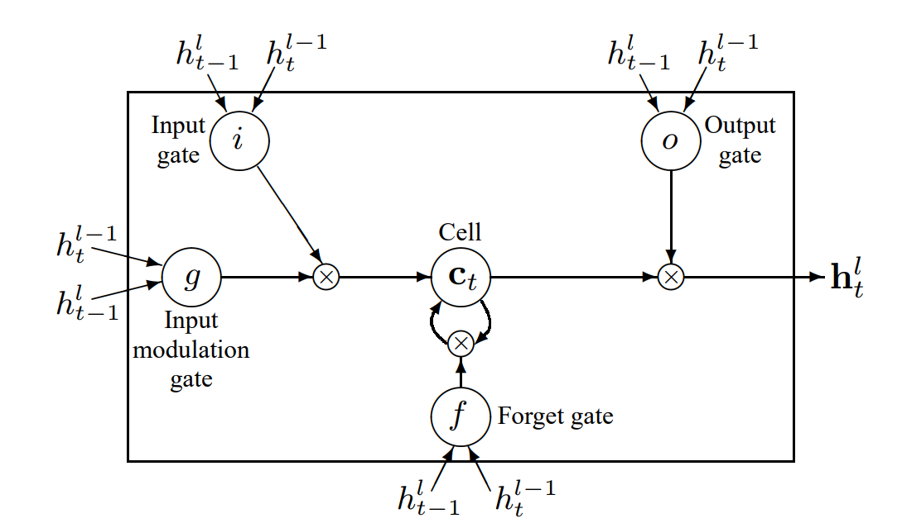

# Recurrent Neural Network (LSTM Cells) for Language Modeling Task

This repo contains code for fitting a probabilistic model to a corpus of natural langauge text files in the lib/data directory. The probabilistic model assigns probabilities on a word level predicting the next word in a sequence given words at previous timesteps in the sequence.

## Recurrent Neural Network (LSTM Cells)
The LSTM Recurrent Neural Network will perform a language modeling task on a corpus dataset of text documents doing word-level prediction. The LSTM will learn states that allow it to properly perform word-level prediction task on the corpus. The Recurrent Neural Network architecture that was used is heavily based on the LSTM architecture of Zaremba in "Recurrent Neural Network Regularization" [1]. A two layer LSTM with 30 recurrent connections (steps) for every LSTM memory cell. The LSTM memory cell using a gating mechanism to update/forget ‘memory’ states as depicted below which works to combat exploding/vanishing gradient and improve sequence learning.
<figure>

</figure>
The number of hidden states of the LSTM were experimented with for the LSTM layers to determine the most effective architecture. A medium LSTM architecture with approximately 2250 units per layer was found to be best for our use case. All parameters were initialized uniformly between -0.5 and 0.5 with dropout applied to 20% of non-recurrent connections. A larger LSTM architecture was experimented with that had approximately 5000 units per layer all parameters initialized uniformly between 0.5 and 0.5 with dropout applied to 20% of non-recurrent connections; however, no performance benefit was seen for the extra time spent training the LSTM model. With both of these architectures the gradients were normalized and clipped using Tensorflow’s style of truncated backpropagation on the backpropagation through time algorithm, which has been found to an effective method of backpropagation error through timesteps in sequence based models.

## Dependencies
* python 3
* Tensorflow 0.9
* Keras
* [Stanford Tokenizer](https://nlp.stanford.edu/software/tokenizer.html)

## How to run
`python3 src/main.py training` to train the word level prediction model testing

`python3 src/main.py testing` to run inference on a trained model to perform the word level prediction

## Dataset used

In order to train the LSTM Recurrent Neural Network we used a small dataset of politician speeches from the Democratic and Republican national conventions of the 2016 presidential election, which we determined to be small enough to train quickly on our computing resources but large enough to serve as an actual test to the method purposed in this document. The LSTM model was trained on a machine containing Nvidia 1080TI GPU and Intel 6800K CPU. The model was built in Keras using a Tensorflow back end to speed up development time and computation.

## References
1) Zaremba, Wojciech. Sutskever, Ilya. Vinyals, Oriol. [Recurrent Neural Network Regularization](https://arxiv.org/abs/1409.2329)
2) [Tensorflow Tutorials for Sequences](https://www.tensorflow.org/tutorials/recurrent)
